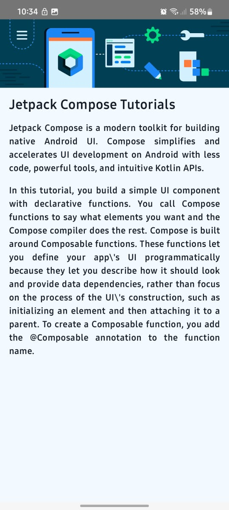
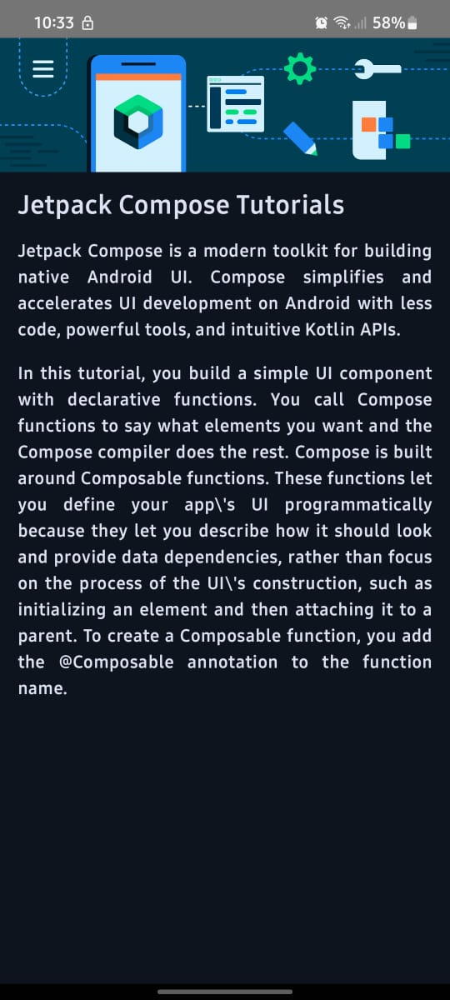

# Article_App
A hands-on codelab project to practice building UI with Jetpack Compose. Covers basic Composable elements for modern Android development.
---
## 📱 App Features:
- 💬 Text styled using `fontSize`, `fontWeight`
- 🖼️ Full width Header image 
- 🎨 Layout modifiers for alignment and padding
- ✅ Includes accessibility via content descriptions

---

## 📸 Preview:
- Light Mode 💡  
  
- Dark Mode 🌙  
-   
